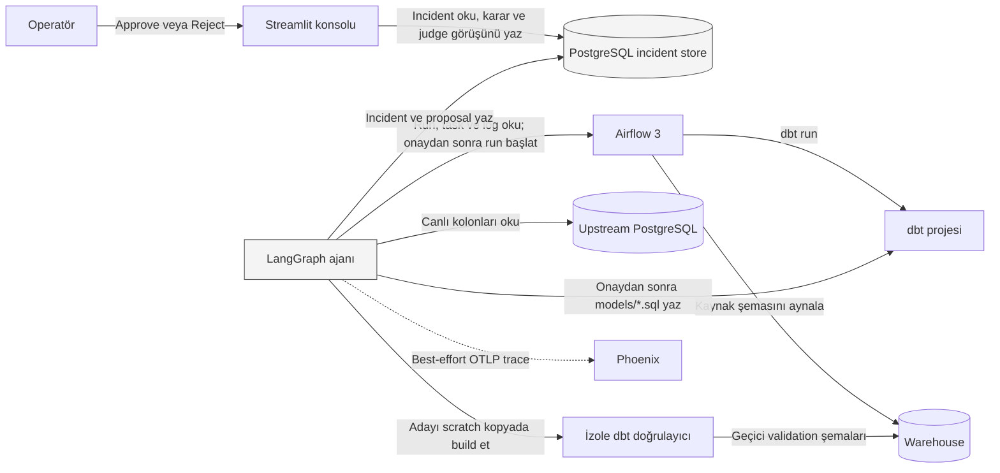
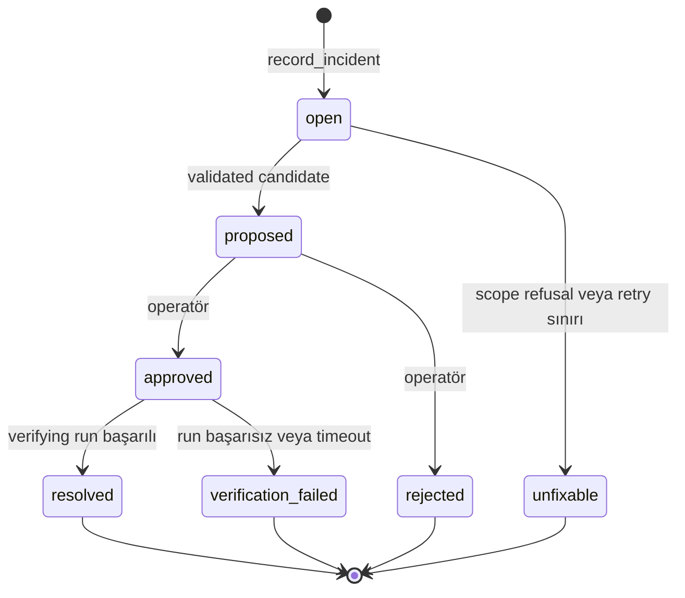

# Ajan mimarisi: High-Level Design

Bu belge, repoda çalışan ajanın **mevcut** mimarisini yüksek seviyede açıklar.
Amaç, kodu satır satır okumadan sistemin sorumluluklarını, güven sınırlarını ve
tasarım gerekçelerini kavramaktır. Geleceğe yönelik fikirler ayrıca belirtilir;
mevcut özellik gibi sunulmaz.

## 1. Problem ve hedef

PoC, upstream sistemin `customer_id` kolonunu `cust_id` olarak değiştirmesiyle
kırılan bir ELT pipeline'ını ele alır. Ajanın hedefi şudur:

1. Başarısız pipeline koşusunu bulmak.
2. Airflow log'u, canlı kaynak şeması ve dbt modelinden kanıt toplamak.
3. Kök nedeni yapılandırılmış biçimde teşhis etmek.
4. Küçük bir dbt düzeltmesi üretmek.
5. Düzeltmeyi gerçek projeye dokunmadan build ederek doğrulamak.
6. İnsan kararı gelene kadar durmak.
7. Yalnızca onaydan sonra düzeltmeyi uygulamak.
8. Kendi başlattığı Airflow koşusuyla iyileşmeyi doğrulamak.

Bu sistem genel amaçlı bir veri mühendisi ajanı değildir. Tek DAG, tek hata
ailesi ve tek yazma kapsamı olan yerel bir PoC'dir.

## 2. Sistem bağlamı



### Bileşenlerin rolleri

| Bileşen | Ajan açısından rolü |
| --- | --- |
| Airflow | Pipeline'ın gerçek koşu durumu, hata log'u ve onay sonrası doğrulama run'ı |
| dbt | Dönüşüm kodu ve aday düzeltmenin deterministik build doğrulayıcısı |
| PostgreSQL kaynak | Upstream sistemin o anki şeması, yani canlı ground truth |
| Incident store | Ajan ile operatör arasındaki kalıcı kanal ve yeniden başlatma sonrası state |
| LangGraph | Karar ve eylem dallarını açık node/edge yapısında yürütür |
| Phoenix | Span ağacı, prompt, response, gecikme, token ve maliyet görünürlüğü |
| Streamlit | Operatörün incident ve diff'i okuyup yalnızca karar verdiği arayüz |

`İzole dbt doğrulayıcı` ayrı bir servis değildir. Agent container içinde çalışan
bir bileşendir; izolasyonunu scratch proje kopyası ve ayrı warehouse şemalarıyla
sağlar.

## 3. Ajanın yüksek seviyeli kontrol döngüsü

Her 20 saniyede bir yeni LangGraph geçişi başlatılır. Graf bellekte askıda
kalmaz. Her geçiş incident store'u ve canlı sistemleri yeniden okuyarak ne
yapacağını belirler.

```text
Durumu oku → uygun dalı seç → kanıt topla veya eylem al → sonucu kaydet → bitir
```

Bu tasarımın sonucu:

- Bir proposal oluşturulduğunda graf biter; insanı bellekte beklemez.
- İnsan kararı ayrı bir servis ve ayrı bir zamanda incident store'a yazılır.
- Sonraki geçiş `approved` durumunu görürse eylem dalına girer.
- Agent container yeniden başlasa bile kalıcı state kaybolmaz.

## 4. Incident yaşam döngüsü



Yaşam döngüsü yalnızca uygulama koduyla korunmaz. PostgreSQL trigger'ı yasal
geçişleri uygular ve terminal incident'ın yeniden açılmasını reddeder. Aynı
anda en fazla bir non-terminal incident bulunabilir.

`approved` ve `rejected` durumlarını ajan üretemez. Yalnızca operatör
konsolunun dar yetkili veritabanı rolü bu karar sütununu güncelleyebilir.

## 5. Human-in-the-loop ve yetki sınırı

Onay kapısı bir UI davranışı değil, üç katmanın birlikte uyguladığı bir sistem
özelliğidir:

1. **Graf:** `proposed` durumundan yazma node'una edge yoktur.
2. **Veritabanı:** `approved` yalnızca `proposed` durumundan gelebilir.
3. **Servis yetkisi:** Streamlit dbt mount'una sahip değildir ve Airflow'da run
   başlatamaz; yalnızca kararı yazar.

Ajanın ilk gerçek proje yazması `apply_fix` node'unda gerçekleşir. Bu node'a
yalnızca router incident store'da `approved` okuduğunda ulaşılır.

## 6. Kanıt ve model kullanımı

Ajan iki model çağrısı yapar:

### Teşhis

Modele şu kanıtlar verilir:

- Başarısız Airflow task'ı
- Task log'u
- Hata veren dbt modelinin yolu ve içeriği
- Kaynak sistemin canlı kolonları

Yanıt serbest metin değildir; `Diagnosis` şemasına uyar. Beklenen ve yeni kolon,
confidence ve operatörün okuyacağı açıklama ayrı alanlardır.

### Proposal

Model hedef dosyayı seçmez. Hedef, dbt hata log'undan çıkarılmış ve sandbox
kapsam kontrolünden geçmiş dosyadır. Modelden yalnızca bu dosyanın yeni tam
içeriği ve kısa özeti istenir.

Bu ayrım, modelin başka bir dosyayı hedef göstermesini tasarım gereği mümkün
olmayan bir seçenek hâline getirir.

## 7. Doğrulama modeli

Bir aday operatöre sunulmadan önce:

1. dbt projesi scratch dizinine kopyalanır.
2. Aday yalnızca bu kopyaya yazılır.
3. Bütün dbt projesi gerçek landing tabloya karşı build edilir.
4. Çıktılar `agent_validation_` önekli geçici şemalara yazılır.
5. Geçici şemalar build öncesinde ve sonrasında temizlenir.

Airflow ve ajan imajları aynı `dbt-requirements.txt` pinlerinden kurulur. Böylece
ajanın doğruladığı dbt sürümü ile pipeline'ın çalıştırdığı sürüm ayrışmaz.

Önemli sınır: dbt build, adayın **çalıştığını** kanıtlar; iş açısından doğru
sonucu ürettiğini kanıtlamaz. Farklı bir LLM, `judge_proposal` node’unda önce ham kanıtları, sonra öneriyi
inceler. Üç gerekçeli kontrolü insan kararına yardımcı olur; veto veya retry
üretmez. Nihai semantik inceleme insan kararında kalır.

## 8. Gözlemlenebilirlik tasarımı

Her agent geçişi bir `agent_pass` root span'i içinde çalışır. LangChain
instrumentation model çağrılarını alt span olarak ekler. Incident açılırken o
geçişin Phoenix trace URL'si kayda yazılır.

Phoenix kritik yolun dışındadır:

- Başlatma veya instrumentation hatası yakalanır.
- Trace gönderimi batch olarak yapılır.
- Phoenix'in storage'ı pipeline PostgreSQL'inden ayrıdır.
- Phoenix çalışmasa da ajan incident çözmeye devam eder.

Bu, “trace kesinlikle kaybolmaz” garantisi değildir. Collector erişilemezse
gözlemlenebilirlik kaybı olabilir; iş akışı durmaz.

Phoenix prompt ve response içeriğini gösterebildiği için production ortamında
redaction, erişim kontrolü, retention ve veri sınıflandırması gerekir. PoC bu
kontrollerin tamamını uygulamaz.

## 9. Restart ve idempotency yaklaşımı

Graf checkpoint kullanmaz. Dayanıklılık incident store ve idempotent/koşullu
işlemlerle sağlanır:

- `open` incident yeniden görülürse `resume_incident` gerekli veriyi canlı
  dünyadan yeniden kurar.
- Proposal sonrası state `proposed` olduğu için ajan `idle` kalır.
- Onaylanan tam dosya içeriği incident store'dan yeniden okunur.
- Aynı içeriği aynı dosyaya yeniden yazmak aynı sonucu üretir.
- Doğrulama run ID'si kaydedildikten sonra sonraki geçiş yeni run başlatmaz,
  yalnızca kaydedilen run'ı izler.

Bilinen pencere: Ajan Airflow run'ını başlatıp ID'yi kaydetmeden çökerse sonraki
geçiş başka bir run başlatabilir. Sonuç yanlış run'ı sahiplenmek değil, fazladan
run oluşmasıdır.

## 10. Bilinçli kapsam sınırları

- Tek DAG ve tek şema değişikliği ailesi
- Incident'lar arasında hafıza yok
- Serbest planlama yok; node sırası sabit
- Bir seferde en fazla bir incident
- Rollback otomasyonu yok
- Semantic data quality doğrulaması yok
- Eval seti ve production regresyon kapısı yok
- Multi-tenant kimlik ve veri sınıflandırması yok
- HA, distributed executor ve yüksek hacim tasarımı yok

## 11. Production'a geçişte gerekenler

Mevcut tasarımın yerine konmuş özellikler değil, açık geliştirme alanlarıdır:

- Incident çeşitliliği için eval ve regresyon veri seti
- Semantic testler, veri sözleşmeleri ve politika doğrulayıcıları
- Secret redaction ve Phoenix erişim/retention politikaları
- Tenant, kimlik, görev ayrılığı ve onay politikaları
- Transactional outbox veya benzeri run-trigger kayıt tutarlılığı
- Rollback için ayrı onay ve değişiklik yönetimi
- Maliyet, rate limit, timeout ve SLO politikaları
- Birden çok incident için concurrency ve deduplication stratejisi

## 12. Kaynaklar

- [LangGraph uygulaması](../agent/graph.py)
- [Agent entry point](../agent/main.py)
- [Incident store istemcisi](../agent/incidents.py)
- [Incident yaşam döngüsü](../postgres/init/03-incident-store.sql)
- [Doğrulayıcı](../agent/validation.py)
- [Sandbox](../agent/sandbox.py)
- [Airflow istemcisi](../agent/orchestrator.py)
- [Trace kurulumu](../agent/traces.py)
- [ADR dizini](../adr/)
- [Low-Level Design](AGENT-LLD.md)
