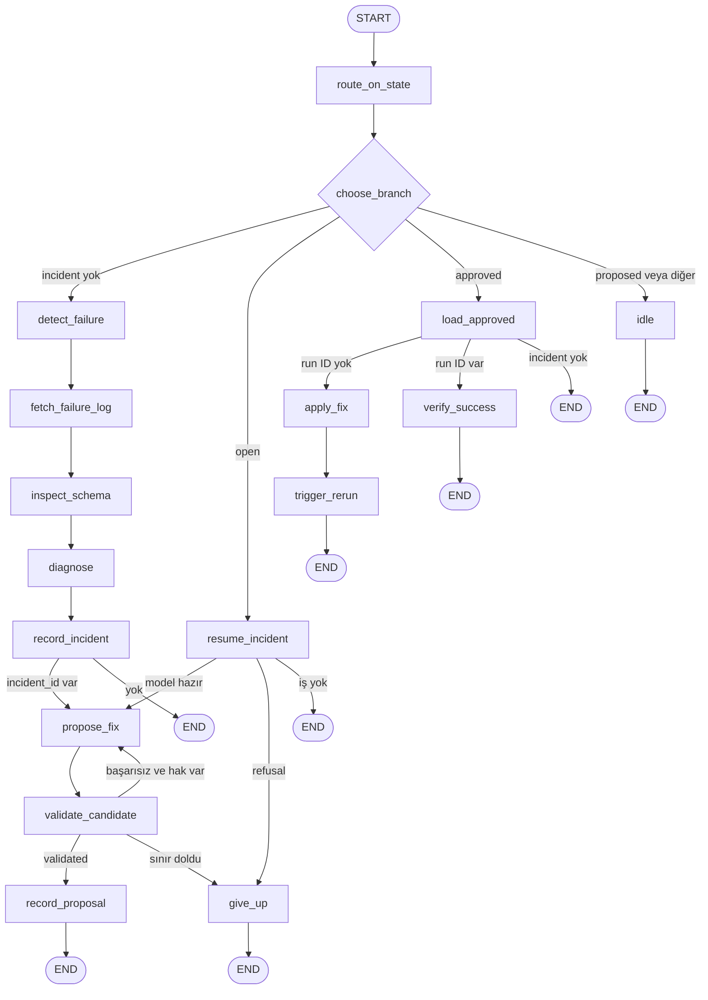
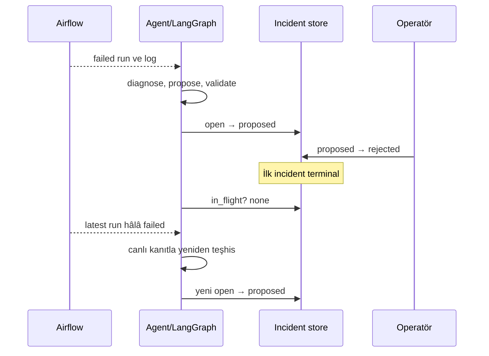

# Ajan mimarisi: Low-Level Design

Bu belge, LangGraph ile geliştirilen ajanın mevcut uygulamasını node, state,
router, side effect ve hata yolu seviyesinde açıklar. Yüksek seviyeli bağlam
için önce [AGENT-HLD.md](AGENT-HLD.md) okunmalıdır.

## 1. Çalışma modeli

`agent/main.py` bağımlılıkları bir kez oluşturur ve sonsuz polling döngüsünde
her tur için `graph.invoke({})` çağırır. Varsayılan polling aralığı 20 saniyedir.

Her invocation:

- boş bir geçici `AgentState` ile başlar,
- incident store'u router içinde okur,
- seçilen dalı sonuna kadar çalıştırır,
- `END` noktasında bellekteki state'i bırakır.

LangGraph checkpoint veya interrupt/resume kullanılmaz. Geçişler arasındaki
kalıcı state PostgreSQL incident store'dur.

## 2. Tam graph



Graf 16 node içerir:

1. `route_on_state`
2. `idle`
3. `detect_failure`
4. `fetch_failure_log`
5. `inspect_schema`
6. `diagnose`
7. `record_incident`
8. `resume_incident`
9. `propose_fix`
10. `validate_candidate`
11. `record_proposal`
12. `give_up`
13. `load_approved`
14. `apply_fix`
15. `trigger_rerun`
16. `verify_success`

`choose_branch`, `after_recording`, `after_resuming`, `after_validation` ve
`after_loading` conditional edge fonksiyonlarıdır; node değildir.

## 3. `AgentState`

`AgentState`, `total=False` bir `TypedDict` olduğu için her dal yalnızca ihtiyaç
duyduğu alanları taşır.

| Alan | Üreten node | Tüketen node | Anlam |
| --- | --- | --- | --- |
| `run_id` | `detect_failure`, `resume_incident` | `fetch_failure_log`, `record_incident` | Başarısız Airflow run ID |
| `failing_task` | `detect_failure`, `resume_incident` | `fetch_failure_log`, `diagnose`, `record_incident` | Başarısız task |
| `failure_output` | `fetch_failure_log`, `resume_incident` | `inspect_schema`, `diagnose`, `record_incident` | ANSI temizlenmiş task log'u |
| `model_path` | `inspect_schema`, `resume_incident`, `load_approved` | Proposal, validation ve apply node'ları | Hata log'undan çıkarılan dbt model yolu |
| `model_sql` | `inspect_schema`, `resume_incident` | `diagnose`, `propose_fix`, `record_proposal` | Güncel model içeriği |
| `source_columns` | `inspect_schema`, `resume_incident` | `diagnose`, `propose_fix` | Canlı kaynak kolonları |
| `diagnosis` | `diagnose`, `resume_incident` | `record_incident`, `propose_fix` | Pydantic `Diagnosis` |
| `incident_id` | `record_incident`, `resume_incident`, `load_approved` | Store yazan node'lar | Kalıcı incident kimliği |
| `attempts` | `propose_fix` | `after_validation`, `give_up` | Aday üretme sayısı |
| `candidate_sql` | `propose_fix` | `validate_candidate`, `record_proposal` | Önerilen tam dosya içeriği |
| `candidate_summary` | `propose_fix` | `record_proposal` | Operatör özeti |
| `build_output` | `validate_candidate` | Retry prompt'u, `give_up` | Son başarısız build çıktısı |
| `validated` | `validate_candidate` | `after_validation` | Aday bütün projede build oldu mu |
| `refusal` | `resume_incident` | `after_resuming`, `give_up` | Scope veya okunabilirlik reddi |
| `contents_to_write` | `load_approved` | `apply_fix` | Operatörün onayladığı içerik |
| `verifying_run_id` | `load_approved`, `trigger_rerun` | `after_loading`, `verify_success` | Ajanın başlattığı doğrulama run'ı |
| `outcome` | Birçok node | `main.py` log'u | İnsan okunur geçiş sonucu |

Bu state yalnızca tek invocation içindir. Kalıcı gerçeklik `ops.incidents`
tablosu ve dış sistemlerdir.

## 4. Router ve conditional edge'ler

### `choose_branch`

| Incident store sonucu | Dal | Gerekçe |
| --- | --- | --- |
| In-flight incident yok | `detect_failure` | Yeni başarısız run aranabilir |
| `open` | `resume_incident` | Önceki geçiş proposal kaydetmeden durmuş olabilir |
| `approved` | `load_approved` | Yazma ve run başlatma yetkisi açılmıştır |
| `proposed` | `idle` | İnsan kararı beklenir |
| Diğer non-terminal durum | `idle` | Aynı anda ikinci iş açılmaz |

Terminal state'ler `in_flight()` sorgusunda hiç dönmez.

### `after_validation`

```text
validated == true                    → record_proposal
validated == false ve attempts < max → propose_fix
validated == false ve attempts >= max→ give_up
```

Varsayılan `max_fix_attempts=3`: ilk aday ve iki retry.

### `after_loading`

```text
incident yok                         → END
verifying_run_id yok                 → apply_fix
verifying_run_id var                 → verify_success
```

Bu ayrım restart sonrasında aynı incident için gereksiz yeni run başlatılmasını
önler.

## 5. Node sözleşmeleri

### Routing node'ları

| Node | Girdi | Çıktı | Side effect / hata davranışı |
| --- | --- | --- | --- |
| `route_on_state` | Geçici state | Aynı state | Side effect yok; conditional edge için isimli giriş |
| `idle` | Yok | `outcome` | Store'u tekrar okuyup bekleme nedenini log'lar |

### Teşhis dalı

| Node | Girdi | Çıktı | Side effect / hata davranışı |
| --- | --- | --- | --- |
| `detect_failure` | Yok | `run_id`, `failing_task` | Airflow latest run ve task API'sini okur; yalnızca `failed` run işler |
| `fetch_failure_log` | `run_id`, `failing_task` | `failure_output` | Airflow task log'unu okur, ANSI escape'leri temizler |
| `inspect_schema` | `failure_output` | `model_path`, `model_sql`, `source_columns` | Regex ile model yolunu çıkarır; sandbox scope kontrolünden sonra dosya ve canlı şema okur |
| `diagnose` | Log, model, kolonlar | `diagnosis` | İlk LLM çağrısı; Pydantic structured output zorunlu |
| `record_incident` | Teşhis state'i | `incident_id` | `open` incident ve o anki trace URL'sini PostgreSQL'e yazar |

`inspect_schema`, yalnızca dbt'nin `in model ... (models/...sql)` biçimindeki
çıktısını tanır. Başka failure formatı genel teşhis yoluna sahip değildir.

### Resume ve proposal dalı

| Node | Girdi | Çıktı | Side effect / hata davranışı |
| --- | --- | --- | --- |
| `resume_incident` | Store'daki `open` incident | Proposal için yeniden kurulmuş state | Modeli ve kaynak kolonlarını canlı okur; bozuk diagnosis veya scope ihlalinde `refusal` üretir |
| `propose_fix` | Diagnosis, model, kolonlar | Candidate ve `attempts+1` | İkinci LLM çağrısı; retry'da önceki build hatasını prompt'a ekler |
| `validate_candidate` | Candidate | `validated`, `build_output` | Scratch kopyada dbt run; exception da başarısız deneme sayılır |
| `record_proposal` | Validated candidate | `outcome` | Tam before/after içeriğini store'a yazar, state'i `proposed` yapar |
| `give_up` | `refusal` veya son build hatası | `outcome` | State'i `unfixable` yapar ve conclusion note yazar |

### Eylem ve doğrulama dalı

| Node | Girdi | Çıktı | Side effect / hata davranışı |
| --- | --- | --- | --- |
| `load_approved` | Store'daki `approved` incident | Onaylanan içerik ve run ID | Proposal anındaki belleğe güvenmez; store'dan yeniden okur |
| `apply_fix` | `model_path`, `contents_to_write` | `outcome` | İlk gerçek proje yazması; `models/*.sql` scope kontrolü uygulanır |
| `trigger_rerun` | `incident_id` | `verifying_run_id` | Airflow'da yeni run başlatır ve ID'yi incident'a yazar |
| `verify_success` | `verifying_run_id` | `outcome` | Yalnızca kaydedilen run'ı okur; success, failed veya timeout sonucu yazar |

## 6. Incident store sözleşmesi

`ops.incidents` tablosu şu bilgileri taşır:

- Başarısız DAG, run, task ve log
- Yapılandırılmış diagnosis ve trace URL
- Hedef model ile before/after tam dosya içerikleri
- Doğrulama run ID
- Terminal sonuç açıklaması ve timestamp'ler

### Yasal geçişler

```text
open     → proposed | unfixable
proposed → approved | rejected
approved → resolved | verification_failed
```

Database trigger:

- Tanımsız state'i reddeder.
- Terminal incident'ın yeniden hareket etmesini reddeder.
- Sonuç state'lerinde `concluded_at` alanını doldurur.
- Yeni incident'ın `open` dışında başlamasını reddeder.

Unique partial index, aynı anda en fazla bir non-terminal incident'a izin verir.

### Reject sonrası neden yeni incident oluşur?

`rejected` terminal olduğu için `in_flight()` artık bu kaydı döndürmez. Kalıcı
pipeline arızası hâlâ latest failed run olarak görünüyorsa sonraki polling turu
aynı run için yeni bir incident açabilir. `failing_run_id` üzerinde deduplication
constraint yoktur. Bu davranış revizyon veya hafıza değildir.

## 7. Dış sistem entegrasyonları

### Airflow istemcisi

`Orchestrator` şu çağrıları yapar:

| Metot | HTTP davranışı | Yetki |
| --- | --- | --- |
| `latest_run()` | Son DAG run'ını okur | Read |
| `failed_task()` | Task instance'ları okur | Read |
| `task_log()` | Belirli try log'unu okur | Read |
| `run()` | Kaydedilen run'ı okur | Read |
| `trigger_run()` | Yeni DAG run oluşturur | Write; yalnızca approved dalından çağrılır |

JWT token gerektiğinde alınır; 401/403 durumunda bir kez yenilenir. Console ayrı
viewer kullanıcısı kullandığı için run başlatamaz.

### dbt doğrulayıcı

- `shutil.copytree` ile temiz scratch kopya
- `target`, `logs`, `dbt_packages` gibi artefact'lar kopyalanmaz
- Candidate yalnızca kopyaya yazılır
- Bütün proje `dbt run` ile çalıştırılır
- Validation schema'ları önce ve sonra silinir
- Subprocess timeout 300 saniyedir
- Başarısız output'un son 6000 karakteri retry prompt'una alınır

### Dosya sandbox'ı

`resolve_target()`:

- Symlink ve `..` çözümlemesinden sonra gerçek path'i kontrol eder.
- Hedefin `<project>/models` altında olmasını zorunlu kılar.
- Yalnızca `.sql` dosyalarına izin verir.

Bütün gerçek proje yazmaları `write_model()` üzerinden geçer.

### Phoenix

`start_tracing()` Phoenix OTLP provider ve LangChain instrumentation kurar.
Kurulum hatası log'lanır ve ajan çalışmaya devam eder. Root `agent_pass` span'i,
bir invocation içindeki node ve model span'larını tek trace altında toplar.

## 8. Sequence'ler

### Reject ve ikinci incident



### Approve, restart ve verification

```mermaid
sequenceDiagram
    participant O as Operatör
    participant DB as Incident store
    participant A as Agent/LangGraph
    participant FS as dbt models
    participant AF as Airflow

    O->>DB: proposed → approved
    A->>DB: approved proposal'ı oku
    A->>FS: onaylanan tam içeriği yaz
    A->>AF: trigger_run
    AF-->>A: verifying_run_id
    A->>DB: run ID kaydet
    Note over A: Invocation biter; restart güvenli
    A->>DB: approved + run ID oku
    A->>AF: yalnızca kaydedilen run'ı oku
    alt success
        A->>DB: approved → resolved
    else failed veya timeout
        A->>DB: approved → verification_failed
    end
```

### Validation retry

```mermaid
sequenceDiagram
    participant G as LangGraph
    participant L as LLM
    participant V as dbt Validator
    participant DB as Incident store

    loop attempts < 3
        G->>L: Candidate iste; önceki hata varsa ekle
        L-->>G: Tam model içeriği
        G->>V: Scratch kopyada dbt run
        V-->>G: built veya build_output
    end
    alt aday build oldu
        G->>DB: open → proposed
    else üç deneme başarısız
        G->>DB: open → unfixable
    end
```

## 9. Hata yolları

| Hata | Mevcut davranış | Sonuç / sınır |
| --- | --- | --- |
| Latest run başarısız değil | `detect_failure` iş yapmaz | Incident açılmaz |
| Failed task bulunamaz | Outcome log'lanır | Incident açılmaz |
| Log model yolu içermiyor | Teşhis ilerlemez | Genel failure handler yok |
| Model yolu scope dışında | Okumadan reddedilir | Yeni teşhis dalında incident açılmayabilir; resume'da `unfixable` |
| Structured output geçersiz | Invocation exception ile biter | Main loop sonraki turda tekrar dener |
| Candidate build olmuyor | Hata retry prompt'una eklenir | Üç denemede `unfixable` |
| Validator çalıştırılamıyor | Başarısız deneme sayılır | Sınırsız retry yok |
| Phoenix erişilemiyor | Log ve best-effort devam | İş akışı sürer, trace kaybolabilir |
| Verifying run failed | `verification_failed` | Uygulanan dosya yerinde kalır |
| Verifying run timeout | `verification_failed` | Timeout varsayılan 300 saniye |

## 10. Güvenlik invariant'ları

1. Model hedef dosya seçmez.
2. Hedef `models/*.sql` dışına çıkamaz.
3. Proposal gerçek projeye yazılmadan scratch kopyada build edilir.
4. `proposed` durumundan eylem dalına edge yoktur.
5. Ajan `approved` veya `rejected` yazamaz.
6. Console dbt projesini göremez ve Airflow run başlatamaz.
7. Uygulanan içerik, operatörün gördüğü incident kaydından yeniden okunur.
8. İyileşme yalnızca ajanın kaydettiği doğrulama run'ına göre sonuçlanır.
9. Phoenix arızası iş akışını durdurmaz.
10. Retry ve verification beklemesi üstten sınırlıdır.

## 11. Bilinen teknik borç ve production boşlukları

- Aynı failed run için tekrar incident açılabilir.
- Run trigger ile run ID kaydı atomik değildir.
- Graph checkpoint kullanılmaz; dayanıklılık domain state'e dayanır.
- LLM exception'ları için ayrı backoff/circuit breaker yoktur.
- Prompt ve response redaction uygulanmaz.
- dbt build semantik doğruluk sağlamaz.
- Tek incident constraint concurrency'yi sınırlar.
- Regex yalnızca beklenen dbt hata formatını tanır.
- Otomatik rollback ve ikinci onay akışı yoktur.

## 12. Kaynak haritası

| Konu | Dosya |
| --- | --- |
| Graph, node ve edge'ler | [`agent/graph.py`](../agent/graph.py) |
| Polling ve tracing root span | [`agent/main.py`](../agent/main.py) |
| Incident store metotları | [`agent/incidents.py`](../agent/incidents.py) |
| Incident SQL ve transition trigger | [`postgres/init/03-incident-store.sql`](../postgres/init/03-incident-store.sql) |
| Airflow REST istemcisi | [`agent/orchestrator.py`](../agent/orchestrator.py) |
| Kanıt toplama | [`agent/evidence.py`](../agent/evidence.py) |
| Diagnosis şeması ve prompt | [`agent/diagnosis.py`](../agent/diagnosis.py) |
| Candidate şeması ve prompt | [`agent/proposal.py`](../agent/proposal.py) |
| dbt doğrulama | [`agent/validation.py`](../agent/validation.py) |
| Dosya kapsamı | [`agent/sandbox.py`](../agent/sandbox.py) |
| Phoenix URL ve tracing | [`agent/traces.py`](../agent/traces.py) |
| Runtime ayarları | [`agent/config.py`](../agent/config.py) |
